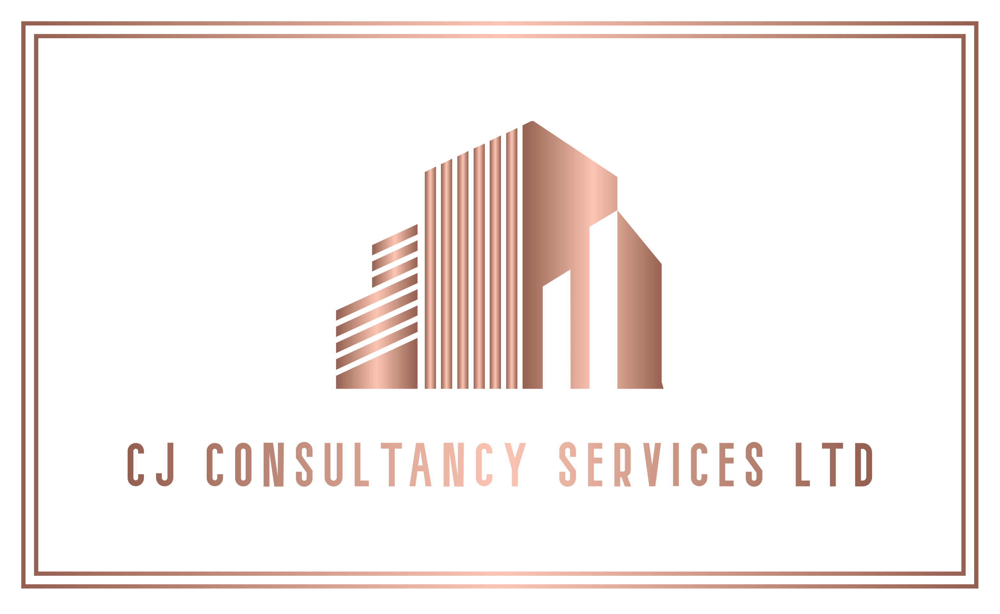

<body style="background-color:#f2f2f2;">

<h1>CJ Consultancy Services Ltd</h1>
<h3>Professional Mechanical & Electrical Compliance • Technical Inspection • Engineering Advisory Services • Asset Verification & Condition Reporting</h3>

<h2>About Us</h2>

CJ Consultancy Services Ltd provides specialist mechanical and electrical compliance, 
lifecycle analysis, asset condition reporting, and technical inspection services across 
commercial, industrial, and specialist environments.

<strong>Your Vision, Our Expertise.</strong>

<h2>Featured Services</h2>
<ul>
    <li>Asset Condition Reporting</li>
    <li>Asset Verification</li>
    <li>Mechanical and Electrical Compliance</li>
    <li>Life Cycle Analysis</li>
    <li>Life Cycle Costing</li>
    <li>Business Focused Maintenance Reporting</li>
    <li>Business Focused Maintenance Scheduling</li>
    <li>Condition Based Maintenance Reporting</li>
    <li>Condition Based Maintenance Scheduling</li>
    <li>Maintenance Gap Analysis Reporting</li>
    <li>Functional Design Verification</li>
    <li>Design Specifications</li>
    <li>Obsolescence Specifications</li>
    <li>PPM Planners</li>
    <li>Log Books</li>
    <li>Auditing</li>
    <li>Technical Services</li>
</ul>

<h2>Website</h2>

Full website: <strong>https://cjcs.co.uk</strong>

Includes: 
Home • Services • About • Contact • UN Theory Overview • UN Theory Full Index • Sitemap

<h1>UN Theory — The Unified Information Substrate</h1>

This repository also hosts the public index and overview for <strong>UN Theory</strong>, 
an independent theoretical physics framework authored by Clint Jefferys.

<h2>UN Theory covers:</h2>

<ul>
    <li><strong>δI‑Substrate Microstructure</strong> The primitive correlation‑structure of reality from which all physical behaviour emerges.</li>
    <li><strong>Emergent Geometry</strong> Spacetime curvature and geodesics arise directly from δI gradients.</li>
    <li><strong>Parity‑Odd Trispectrum</strong> A universal invariant appearing across cosmology, lensing, shear, and correlation statistics.</li>
    <li><strong>Quantum Behaviour</strong> Quantum mechanics emerges from canonical δI evolution and correlation structure.</li>
    <li><strong>Cosmological Dynamics</strong> Expansion history, vacuum closure, and early‑epoch AGN/quasar formation.</li>
    <li><strong>Planetary‑Scale δI Compression</strong> Seismic behaviour, mantle structure, and sparse‑regime planetary dynamics.</li>
    <li><strong>Ultra‑Global Fixed Point</strong> The asymptotic correlation geometry governing late‑epoch behaviour.</li>
    <li><strong>Terminal State Architecture</strong> The final collapse of all emergence back to the primitive correlation object.</li>
    <li><strong>Full Structural Unification</strong> Derivation of GR, QFT, Standard Model, tensor sectors, cosmology, and quantum behaviour from a single substrate.</li>
</ul>

<h2>UN Theory Pages</h2>

UN Theory Overview 
UN Theory Full Index 
Links to all sector papers, volumes, prediction papers, and mathematical closure documents

<h2>External Research Archive</h2>

Full UN Theory research: 
<a href="https://untheory.github.io/UN-Theory/">https://untheory.github.io/UN-Theory/</a>

Zenodo Community: 
<a href="https://zenodo.org/communities/un-theory">https://zenodo.org/communities/un-theory</a>

<h2>Contact</h2>

CJ Consultancy Services Ltd 
Suffolk 
United Kingdom  
Email: <strong>info@cjcs.co.uk</strong>

<h2>Copyright</h2>

© 2026 CJ Consultancy Services Ltd 
© 2026 UN Theory — The Unified Information Substrate

</body>
